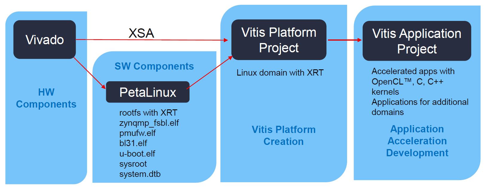
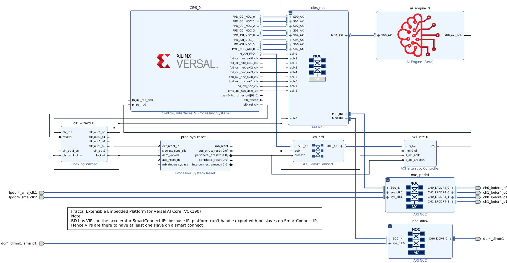

[<p align="right"></p>](https://ec.europa.eu/info/index_en "European Commision")
[<p align="center"></p>](https://cordis.europa.eu/project/id/877056/es "FRACTAL")

# FRACTAL Platform on Xilinx Versal&trade; devices

The [FRACTAL](https://cordis.europa.eu/project/id/877056) project (funded under the [INDUSTRIAL LEADERSHIP](https://cordis.europa.eu/programme/id/H2020-EU.2.1.1.) program of the [European Commission](https://ec.europa.eu/info/index_en)) is developing a computing node on which to base a cognitive fractal network capable of learning from and responding to its environment. It supports seamless, fast, and reliable interaction between the physical world and the cloud for applications ranging from self-driving cars to remote medical procedures.

This repository includes all necessary files and scripts for developing a Vitis Application Project on the FRACTAL platform (which is also a Vitis Platform Project). These application projects are software projects that target the Versal&trade; AI Core Series VCK190 Evaluation Kit to build a custom HW accelerated application.

[](./documentation/embedded_application_development_flow.png "Embedded Application Development Flow")

## Getting Started

> **Quick-start:**
> 
> The VCK190 image provided by Xilinx in the [Vitis AI User Guide](https://docs.xilinx.com/r/3.0-English/ug1414-vitis-ai/Flashing-the-OS-Image-to-the-SD-Card) is suited for most use cases without further customization. The image provided in version 3.0 of this document has been successfully validated on HW, and has all the features provided in this repository available either natively or through the [DNF package manager](https://xilinx-wiki.atlassian.net/wiki/spaces/A/pages/18842406/Dnf+package+manager).
> 
> In case there would be any further HW or PetaLinux requirement not covered by the Xilinx's image, then proceed with the following guide to customize the Vivado Project and the PetaLinux configuration to generate a new Versal image for the Vitis Unified Software Platform.

The whole build flow requires [Vitis Core Development Kit](https://www.xilinx.com/products/design-tools/vitis/vitis-platform.html) version 2021.2 installed in the host machine with a suitable license for Vivado&reg; Design Suite (a temporary license for Versal devices should be enough). It is available from the following link: [Vitis (SW Developer) - Download link](https://www.xilinx.com/support/download/index.html/content/xilinx/en/downloadNav/vitis/2021-2.html).

Additionally, download the PetaLinux installer to the [src/](src/) directory (it is available from [Xilinx's website](https://www.xilinx.com/support/download/index.html/content/xilinx/en/downloadNav/embedded-platforms/2021-2.html)). It is required to build the PetaLinux OS.

> **Optional**:
>
> PetaLinux OS can be build on a docker container (generated automatically). The Docker build-flow is disabled by default, but Docker is required to be already installed in the host machine if enabled. Follow these [instructions](https://docs.docker.com/engine/install/ubuntu/#install-using-the-convenience-script).

Also, make sure to download the VCK190 BSP from [Xilinx's website](https://www.xilinx.com/support/download/index.html/content/xilinx/en/downloadNav/embedded-platforms/2021-2.html), as well as the Versal Common image also from [Xilinx's website](https://www.xilinx.com/support/download/index.html/content/xilinx/en/downloadNav/embedded-design-tools/2021-2.html), and place them in the [src/](src/) directory.

To start the build process, execute the following command from the Linux terminal:

```sh
# Source Vivado and Vitis settings from their respective installation directories
source <XILINX_INSTALL_DIR>/Vitis/2021.2/settings64.sh

# Make the FRACTAL Platform from scratch
make all
```
<!-- source <XILINX_INSTALL_DIR>/Vivado/2021.2/settings64.sh -->

It executes the following tasks:

1. Clean all output products (`make clean_all`):
   1. Clean HW platform (`make clean_hw_platform`)
   1. Clean PetaLinux Docker container (`make clean_docker`)
   1. Clean PetaLinux image (`make clean_petalinux_os`)
   1. Clean SW platform (`make clean_sw_platform`)
1. Check all requirements (`make check_all`):
   1. Check Vivado version (`make check_vivado`)
   1. Check Vitis version (`make check_vitis`)
   1. Check if PetaLinux installer is present in [src/](src/) directory
   1. Check if VCK190's BSP is present in [src/](src/) directory
1. Build HW platform on Vivado (`make hw_platform` :fast_forward: [vivado/](vivado/) `make all`)
   1. Clean [vivado/](vivado/) directory ([vivado/](vivado/) `make clean`)
   1. Create HW platform in Vivado ([vivado/](vivado/) `make xsa` :fast_forward:[vivado/src/platform_xsa.tcl](vivado/src/platform_xsa.tcl))
      1. Create block design ([vivado/src/dr.bd.tcl](vivado/src/dr.bd.tcl))
      1. Set platform properties ([vivado/src/pfm_decls.tcl](vivado/src/pfm_decls.tcl))
      1. QOR settings ([vivado/src/qor_scripts/](vivado/src/qor_scripts/))
      1. Generate output products ([vivado/src/platform_xsa.tcl](vivado/src/platform_xsa.tcl))
1. (Optional) Build PetaLinux Docker container (`make petalinux-2021.2_docker`)
   1. Clean the Docker image if required (`make clean_docker`)
   1. Build the Docker image ([Dockerfile](Dockerfile))
1. Build OS with PetaLinux (`make petalinux_os` :fast_forward: Docker :fast_forward: [petalinux/](petalinux/) `make all`)
   1. Clean the [petalinux/](petalinux/) directory ([petalinux/](petalinux/) `make clean`)
   1. Create PetaLinux project ([petalinux/](petalinux/) `make create`)
   1. Configure PetaLinux project ([petalinux/](petalinux/) `make update_all_configs`)
      1. Link Vivado's XSA file to project ([petalinux/](petalinux/) `make update_hw`)
      1. Set main parameters ([petalinux/](petalinux/) `make update_main_config`)
      1. Configure kernel ([petalinux/](petalinux/) `make update_kernel_config`)
      1. Configure RootFS ([petalinux/](petalinux/) `make update_rootfs_config`)
      1. Configure external sources/layers ([petalinux/](petalinux/) `make update_ext_src_config`)
      1. Configure Xen Hypervisor if necessary ([petalinux/](petalinux/) `make update_xen_hypervisor`)
   1. Build project ([petalinux/](petalinux/) `make update_build`)
   1. Package BOOT Image for base platforms ([petalinux/](petalinux/) `make update_bootimage`)
   1. Build & Package SysRoot for SDK/Vitis ([petalinux/](petalinux/) `make update_sysroot`)
   1. Extract Versal Common Image from Xilinx's archive ([petalinux/](petalinux/) `make common_image`)[^1]
   1. Create the `sd_card` directory with all required files for flashing the image to a compatible SD card ([petalinux/](petalinux/) `make sd_card`)
<!-- 1. Build SW platform on Vitis (`make sw_platform` :fast_forward: [vitis/](vitis/) `make all`) -->
   <!-- 1. Clean the [vitis/](vitis/) directory ([vitis/](vitis/) `make clean`) -->
   <!-- 1. Copy over necessary Vivado files ([vitis/](vitis/) `make import_from_vivado`) -->
   <!-- 1. Copy over necessary PetaLinux files ([vitis/](vitis/) `make import_from_petalinux`) -->
   <!-- 1. Create the Vitis platform ([vitis/](vitis/) `make sw_platform` :fast_forward:[vitis/src/build_sw_platform.tcl](vitis/src/build_sw_platform.tcl)) -->
   <!-- 1. ... -->

[^1]: During development of this platform, major roadblocks have been found such that the platform was not able to boot on HW with the output products from PetaLinux. We believe that the platform workflow is not yet ready for the Versal ACAP family of devices and that some of the PetaLinux Tool commands are not generating the appropriate images. Therefore, we recommend using the Versal common image offered by Xilinx as much as possible. For this project, only the BOOT.BIN binary and the RootFS image are used from the build process. The rest of the required files are taken from the the Versal Common Image.

To boot the Fractal Versal Platform image on HW, follow the instructions described on the [UG1144-PetaLinux Tools Documentation: Reference Guide](https://docs.xilinx.com/r/2021.2-English/ug1144-petalinux-tools-reference-guide/Steps-to-Boot-a-PetaLinux-Image-on-Hardware-with-SD-Card) under the section *Packaging and Booting > Booting PetaLinux Image on Hardware with an SD Card > Steps to Boot a PetaLinux Image on Hardware with SD card > Steps to Flash and Boot the PetaLinux Images Manually*.

Additional `make` targets are:

```sh
# Check the Xilinx's version installed in the host machine:
make check_all

# Build only the Vivado project:
make hw_platform
# Launch the Vivado project for inspection:
make launch_vivado

# Create the Docker container for building PetaLinux:
make petalinux-2021.2_docker
# Run the Docker container and open the terminal:
make run_petalinux_docker

# Build the PetaLinux image:
make petalinux_os
# Rebuild the PetaLinux image in case the configuration has been changed:
make update_petalinux_os

# Launch the Qemu emulator running the created PetaLinux image:
make qemu

# Build the SW platform:
make sw_platform

# Clean all the output products. Internally it calls:
#   - make clean_hw_platform
#   - make clean_docker
#   - make clean_petalinux_os
#   - make clean_sw_platform
make clean_all
# Clean all the Vivado output products:
make clean_hw_platform
# Clean the Docker container:
make clean_docker
# Clean the PetaLinux image:
make clean_petalinux_os
# Clean the SW platform:
make clean_sw_platform
```

The following diagram explains the build-flow dependencies.

> **Notes:**
>
> - The diagram should be read from top to down.
> - The diagram is for illustration only. The actual build-flow is more sequential.


## Fractal Extensible Embedded Platform Specifications

[](./documentation/block_diagram.png "Block Diagram of Fractal Extensible Embedded Platform for Versal AI Core (VCK190)")

[VCK190 Specifications](https://www.xilinx.com/products/boards-and-kits/vck190.html#specifications)

FRACTAL custom platform:

- CPU:
  - **2x** Arm Cortex-A72 cores (APU)
  - **2x** Arm Cortex-R5F cores (RPU)
- Memory:
  - **8 GB** DDR4
  - **8 GB** LPDDR4 (4x 16 Gb)
- GPU:
  - Versal **AI Engine**
- Programmable Logic:
  - Clocks:
    1. 62.5 MHz
    1. 125 MHz
    1. 250 MHz
    1. 333.33 MHz
    1. **500 MHz** (default clock, with reset)
  - Up to **15 RTL acceleration kernels** (XRT)
    <!-- - **22** Synchronous Interrupts @100Mhz:
        - 11 FPD Interrupts
        - 11 LPD Interrupts -->
    <!-- - GPIO EMIO:
      - PMC: **60**
      - PS: **32** -->
  - DSP Engine:
    - **DSP58** (27x24 multiplier, 58-bit wide accumulator, and negate functionality)
      - Scalar fixed-point ALU mode
      - Vector fixed-point ALU mode (3xINT8 dot product)
      - Complex arithmetic unit mode (18x18 MACC)
      - Floating-point arithmetic mode (32-bit single-precision & 16-bit half-precision, multiplier & adder)
- Boot Mode:
  - **Micro SD**
  - **QSPI** (Boot Module)
  <!-- - Debug:
  - **JTAG** (HSDP can be enabled manually from Vivado) -->
  <!-- - System monitoring:
  - **Yes**, configurable to output through I2C or PMBus -->
- PetaLinux configuration:
  - Main configuration: `petalinux-config` ([project-spec/configs/config](./petalinux/)):
    <!-- - Automatic **HW** configuration -->
    - **DTG** Settings:
      - Machine name (`CONFIG_SUBSYSTEM_MACHINE_NAME`):
        - `versal-vck190-reva-x-ebm-01-reva` (if using the BSP)
        - `template` (if using the template)
    - **U-Boot** configuration:
      - Target (`CONFIG_SUBSYSTEM_UBOOT_CONFIG_TARGET`):
        - `xilinx_versal_virt_defconfig`
    - **Image Packaging** configuration:
      - Disable Initial RAM File System: `initramfs` (`SUBSYSTEM_ROOTFS_INITRAMFS`)
      - Enable Initial RAM Disk: `initrd` (`SUBSYSTEM_ROOTFS_INITRD`)
      - Initial RAM File System name (`CONFIG_SUBSYSTEM_INITRAMFS_IMAGE_NAME`):
        - `petalinux-image-minimal`
      - Root FS formats (`CONFIG_SUBSYSTEM_RFS_FORMATS`):
        - `cpio`
        - `cpio.gz`
        - `cpio.gz.u-boot`
        - `tar.gz`
        - `jffs2`
        - `ext4`
    - **Firmware Version** configuration:
      - Hostname (`CONFIG_SUBSYSTEM_HOSTNAME`):
        - `fractal_versal`
      - Product (`CONFIG_SUBSYSTEM_PRODUCT`):
        - `fractal_versal`
    - **Yocto** settings:
      - Board name (`CONFIG_SUBSYSTEM_BOARD_NAME`):
        - `vck190`
      - Enable extended Yocto build tools (`YOCTO_BUILDTOOLS_EXTENDED`)
      - (_Optional_)
        - Enable local Linux/Yocto sources (`CONFIG_YOCTO_BB_NO_NETWORK`)
        - Disable network Linux/Yocto sources (`CONFIG_YOCTO_NETWORK_SSTATE_FEEDS`)
        - Local sstate directory (`CONFIG_YOCTO_LOCAL_SSTATE_FEEDS_URL`):
          - `/tmp/petalinux/workspace/sstate_aarch64_2021.2/aarch64`
  - RootFS configuration: `petalinux-config -c rootfs` ([project-spec/configs/rootfs_config](./petalinux/)):
    - **File System** packages:
      - Base:
        - Dandified YUM package manager (`dnf`)
        - File System Resize Tool (`e2fsprogs-mke2fs` & `e2fsprogs-resize2fs`)
        - FPGA Manager Script (`fpga-manager-script`)
        - _Haveged_ unpredictable random number generator (`haveged`)
        - Memory Technology Devices utilities (`mtd-utils`)
      - Console:
        - Network:
          - CAN utilities (`can-utils`)
          - OpenSSH (`openssh`, `openssh-ssh`, `openssh-sftp`, `openssh-sftp-server` & `openssh-sshd`)
        - Tools:
          - Partition Editor (`parted`)
        - Utilities:
          - Advanced Linux Sound Architecture (`alsa-tools` & `alsa-utils`)
          - Bash completion (`bash-completion`)
          - File compression (`bzip2`, `gzip`, `unzip` & 'zip')
          - File information (`file`)
          - Basic directory searching utilities (`findutils`)
          - GNU Awk (`gawk`)
          - Git version control (`git`)
          - Global Regular Expression Print (`grep`)
          - HDD parameters (`hdparm`)
          - File visualization tool (`less`)
          - LMbench performance analysis (`lmbench`)
          - PCI utilities (`pciutils`)
          - (`pkgconfig`)
      - Development:
        - Binary utilities (`binutils`)
        - Python (<!--`packagegroup-petalinux-python-modules` -->_See tables below for a detailed list of Python modules_)
      - Libraries:
        - Xilinx Runtime Library (`xrt`)
        - Xilinx AI Engine driver (`ai-engine-driver`)
      - Miscellaneous:
        - sysfs library (`libsysfs`)
    - **PetaLinux** package groups:
      - PetaLinux basic (`packagegroup-petalinux`)
      - Sensor interface libraries (MRAA & UPM) (`packagegroup-petalinux-mraa`)
      - Open AMP for RTOS control (`packagegroup-petalinux-openamp)
      - Open CV (`packagegroup-petalinux-opencv`)
      - PetaLinux utilities (`packagegroup-petalinux-utils`)
    - **Image** features:
      - Auto login (`auto-login`)
    - **Apps**:
      - GPIO demo (`gpio-demo`)
      - Peek-Poke (`peek-poke`)
  - XEN Hypervisor configuration:
    - Enable XEN Hypervisor package in RootFS configuration (`packagegroup-petalinux-xen`)
    - Include XEN device tree ([xen.dtsi](./petalinux/src/xen.dtsi)) in [system-user.dtsi](./petalinux/) and [device-tree.bbappend](./petalinux/)
  - External sources configuration:
    - External Yocto layers:
      - **TensorFlow** (`meta-tensorflow`)
    - Custom layers:
      - **FRACTAL** (`meta-fractal` - _Empty right now_)

| **Python 2**       |                  |                |                        |                    |                  |
| ------------------ | ---------------- | -------------- | ---------------------- | ------------------ | ---------------- |
| python             | python-core      | python-gdbm    | python-mime            | python-pprint      | python-syslog    |
| libpython2         | python-crypt     | python-hotshot | python-misc            | python-profile     | python-terminal  |
| python-2to3        | python-ctypes    | python-html    | python-mmap            | python-pydoc       | python-tests     |
| python-argparse    | python-curses    | python-idle    | python-modules         | python-re          | python-textutils |
| python-audio       | python-datetime  | python-image   | python-multiprocessing | python-resource    | python-threading |
| python-bsddb       | python-db        | python-io      | python-netclient       | python-robotparser | python-tkinter   |
| python-codecs      | python-debugger  | python-json    | python-netserver       | python-shell       | python-unittest  |
| python-compile     | python-difflib   | python-lang    | python-numbers         | python-smtpd       | python-unixadmin |
| python-compiler    | python-distutils | python-logging | python-pickle          | python-sqlite3     | python-xml       |
| python-compression | python-email     | python-mailbox | python-pkgutil         | python-stringold   | python-xmlrpc    |
| python-contextlib  | python-fcntl     | python-math    | python-plistlib        | python-subprocess  | python-zlib      |

| **Python 3**        |                   |                 |                         |                    |                   |
| ------------------- | ----------------- | --------------- | ----------------------- | ------------------ | ----------------- |
| python3             | python3-ctypes    | python3-git     | python3-misc            | python3-pprint     | python3-sqlite3   |
| libpython3          | python3-curses    | python3-gitdb   | python3-mmap            | python3-profile    | python3-stringold |
| python3-2to3        | python3-datetime  | python3-html    | python3-modules         | python3-pydoc      | python3-syslog    |
| python3-async       | python3-db        | python3-idle    | python3-multiprocessing | python3-pygobject  | python3-terminal  |
| python3-asyncio     | python3-dbus      | python3-image   | python3-netclient       | python3-pyvenv     | python3-tests     |
| python3-audio       | python3-debugger  | python3-io      | python3-netserver       | python3-resource   | python3-threading |
| python3-codecs      | python3-difflib   | python3-json    | python3-nose            | python3-scons      | python3-tkinter   |
| python3-compile     | python3-distutils | python3-logging | python3-numbers         | python3-setuptools | python3-unittest  |
| python3-compression | python3-email     | python3-mailbox | python3-numpy           | python3-shell      | python3-unixadmin |
| python3-core        | python3-fcntl     | python3-math    | python3-pickle          | python3-smmap      | python3-xml       |
| python3-crypt       | python3-gdbm      | python3-mime    | python3-pkgutil         | python3-smtpd      | python3-xmlrpc    |

### Notes

- XSA: CIPS settings added manually; configured in the bd-files.
- This design is fully FAT-32 (ext4 is not used but can easily be enabled).

<!-- ## Design Considerations

> Under Review -->

  <!-- - **ps_apps**: PS applications can easily be added by adding a sub-project for each in `ps_apps`.
    - Vitis will automatically package them and they will end up on the sd_card.
    - The `[PS Application].exe` (extension **MUST** be .exe) MUST end up in the `ps_apps` dir.
  - **ip**: Kernels can be added by just adding a sub-project in `ip`.
    - You will need to update the `vitis/src/system.cfg` file to setup the correct connections/clocks.
    - A `[kernel].xo` file **MUST** end up in the `ip` dir
    - An extra aie graph **MUST** be added in the `ip/aie` dir, the `ip/aie/Makefile` will need adaptations. -->

## References

The following documents provide supplemental information for this tutorial.

### [Vitis Tutorials](https://xilinx.github.io/Vitis-Tutorials/2021-2/build/html/index.html)

It contains sections on AI Engine graph development, how to use the AI Engine compiler, AI Engine simulation, and performance analysis.

- [GitHub Repo](https://github.com/Xilinx/Vitis-Tutorials/tree/2021.2)

- [Versal Custom Thin Platform Extensible System](https://github.com/Xilinx/Vitis-Tutorials/tree/2021.2/Developer_Contributed/01-Versal_Custom_Thin_Platform_Extensible_System)
  It follows the same approach to create a thin Versal platform. For the PetaLinux configuration script documentation, please refer to this repository.

### [Vitis Unified Software Development Platform 2021.2 Documentation](https://docs.xilinx.com/v/u/ug1416-vitis-documentation)

The following are links to Vitis's related information referenced in this tutorial:

- [Vitis Application Acceleration Development Flow Documentation](https://docs.xilinx.com/v/u/ug1416-vitis-documentation)

- [Vitis Application Acceleration Development Flow Tutorials](https://github.com/Xilinx/Vitis-Tutorials/tree/2021.2)

### [Xilinx Runtime (XRT) Architecture](https://xilinx.github.io/XRT/2021.2/html/index.html)

The following are links to the XRT information used in this tutorial:

- [Documentation](https://xilinx.github.io/XRT/2021.2/html/index.html): Explains general XRT API calls used in the PS Host Application.

- [GitHub Repo](https://github.com/Xilinx/XRT/tree/2021.2): Contains the XRT source code.

- [XRT AIE API](https://github.com/Xilinx/XRT/blob/2021.2/src/runtime_src/core/include/xrt/xrt_aie.h): Documents the AI Engine XRT API calls

## Revision History

- December 2021 - Initial Release
- March 2022 - Getting Started update explaining the whole build flow.
- April 2022 - Update to Xilinx's 2021.2 development flow

## License

Licensed under the Apache License, Version 2.0 (the "License");
you may not use this file except in compliance with the License.
You may obtain a copy of the License at:
[http://www.apache.org/licenses/LICENSE-2.0](http://www.apache.org/licenses/LICENSE-2.0).

Unless required by applicable law or agreed to in writing, software
distributed under the License is distributed on an "AS IS" BASIS,
WITHOUT WARRANTIES OR CONDITIONS OF ANY KIND, either express or implied.
See the License for the specific language governing permissions and
limitations under the License.
